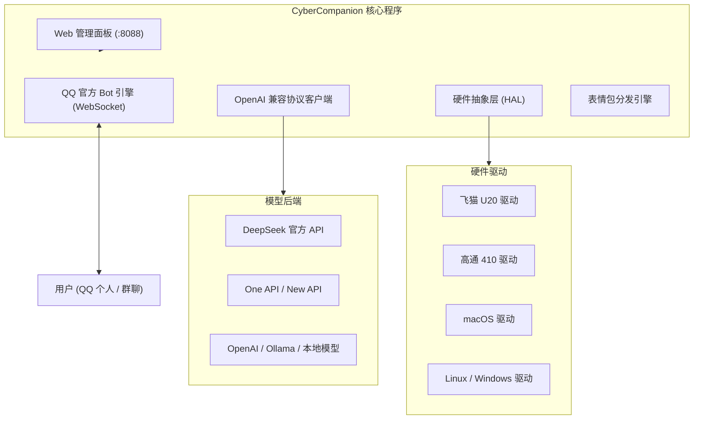

# CyberCompanion

将随身 WiFi、开发板、软路由或个人电脑改造成 24 小时在线的 QQ 机器人助手。单二进制文件部署，内置 Web 管理面板，常驻内存约 20MB。

[](https://golang.org)
[](LICENSE)
[]()
[](https://q.qq.com)

---

## 特性

- **轻量单二进制**：Go 语言编写，前端静态文件打包在可执行文件内部，常驻内存约 20MB，无 Python/Node 等运行环境依赖。
- **硬件状态抽象 (HAL)**：
  - **飞猫 U20 (Unisoc T7510)**：读取 5G NR 信号、RSRP、基站信息、当日出入流量与核心温度。
  - **高通 410 / 210 (MSM8916/8909)**：适配 OpenStick 与各分支随身 WiFi，读取基带状态与负载。
  - **macOS / Windows / Linux**：读取 CPU 架构、系统负载、内存用量与网络连接。
- **内置 Web 管理面板**：默认监听 `8088` 端口，提供状态监控、人设切换、API 密钥修改与实时日志流。
- **多模态图片识别**：支持在 QQ 对话中直接发送图片，调用大模型视觉接口返回内容分析。
- **情境表情包发送**：根据用户输入意图（打招呼、表白、调侃、询问饮食等）自动发送对应的 Base64 本地表情，规避图床防盗链与图裂问题。
- **人设与提示词切换**：预设大肥鱼、爱莉希雅、猫娘与极客助手 4 种性格，支持在聊天或 Web 面板中自定义 System Prompt。
- **权限与访客隔离**：普通用户仅能闲聊与识图，无法触发设备重启或执行命令；发送指定暗号可认证为管理员并持久化保存。

---

## 架构



---

## 硬件支持

| 设备分类 | 代表硬件 / 芯片 | 对应架构 | 硬件遥测 | 运行方式 |
| :--- | :--- | :--- | :--- | :--- |
| **5G 随身 WiFi** | 飞猫 U20 (Unisoc T7510 / SP9863A) | `linux-arm64` | 5G 信号、RSRP、流量、三路温度、USB 状态 | 后台进程 / 开机脚本 |
| **4G 随身 WiFi** | 高通 410 (MSM8916 / 8909) | `linux-armv7` | 4G 信号、基带状态、负载、内存 | OpenStick / Debian 棒 |
| **Mac (Apple Silicon)** | M1 / M2 / M3 / M4 | `darwin-arm64` | CPU 型号、系统负载、内存用量 | 直接运行 |
| **Mac (Intel)** | 2020 之前 Intel Mac | `darwin-amd64` | 系统负载、内存用量 | 直接运行 |
| **开发板 / 软路由** | 树莓派 4/5, x86 软路由 | `linux-arm64` / `linux-amd64` | SoC 温度、负载、网卡流量 | Systemd / Docker |
| **Android 手机 / 平板** | Android 7.0+ (ARM64 / ARMv7) | `.apk` 安装包 | 手机网络、前台守护、内置图形界面 | APK 直接安装运行 (免 Root) |
| **Windows PC** | Windows 10 / 11 (x64) | `windows-amd64` | 内存、系统信息 | `cybercompanion.exe` |

---

## 快速开始

### 方式一：Android 手机 / 平板直接安装 (推荐手机用户)

前往 [Releases 页面](https://github.com/Elysia-SHY/CyberCompanion/releases) 下载 `CyberCompanion-Android-v1.0.0.apk`。
- 安装后直接启动，应用通过前台常驻服务维持后台 24 小时运行。
- 打开应用即可在手机屏幕上直接操作 Web 控制台，无需 Root 权限。

### 方式二：随身 WiFi 与 Linux 一键安装

```bash
curl -sSL https://raw.githubusercontent.com/Elysia-SHY/CyberCompanion/main/scripts/install.sh | bash
```

脚本自动检测当前机器架构并下载对应二进制文件，配置后台启动。

### 方式三：手动下载运行 (Mac / PC / 服务器)

前往 [Releases 页面](https://github.com/Elysia-SHY/CyberCompanion/releases) 下载对应架构的可执行文件：

```bash
# macOS Apple Silicon
chmod +x cybercompanion-darwin-arm64
./cybercompanion-darwin-arm64

# Linux / 飞猫 U20
chmod +x cybercompanion-linux-arm64
./cybercompanion-linux-arm64

# Windows
cybercompanion.exe
```

启动后访问 `http://localhost:8088`（随身 WiFi 连接热点后访问 `http://192.168.88.1:8088`）进入管理面板。

---

## Web 管理面板

- **状态概览**：查看设备当前网络信号、流量消耗、内存利用率与 QQ 网关连接状态。
- **人设配置**：点击预设卡片切换角色，或在输入框中直接修改 System Prompt。
- **参数设置**：修改 QQ 机器人的 AppID、Secret、模型接口地址与认证暗号，保存后即时生效。
- **运行日志**：查看 WebSocket 消息收发与大模型调用详情。

---

## 交互指令

### 管理员指令
- `状态` 或 `/status`：输出当前硬件信号、流量、温度与内存信息。
- `人设`：查看当前人设与可选预设。
- `人设 陪伴` / `人设 大肥鱼` / `人设 猫娘` / `人设 助手`：切换指定性格。
- `设定人设 <文本>`：自定义人设并重置上下文。
- `清除记忆` 或 `/clear`：清空双方的多轮上下文记录。
- `重启` 或 `/reboot`：在支持的设备上执行系统软重启。
- `/exec <命令>`：在设备终端执行命令并返回输出。

### 认证方式
初次使用时向机器人私聊发送配置的 `passcode`（默认为 `复活吧我的爱人！！！elyisa`），程序会将当前用户的 OpenID 写入 `owners.json`，完成管理员认证。

---

## 源码编译

编译需要 Go 1.21 或更高版本：

```bash
git clone https://github.com/Elysia-SHY/CyberCompanion.git
cd CyberCompanion

# 编译当前平台
go build -o cybercompanion ./cmd/cybercompanion

# 交叉编译 macOS Apple Silicon
GOOS=darwin GOARCH=arm64 go build -o cybercompanion-darwin-arm64 ./cmd/cybercompanion

# 交叉编译 飞猫 U20
GOOS=linux GOARCH=arm64 go build -o cybercompanion-linux-arm64 ./cmd/cybercompanion

# 交叉编译 高通 410
GOOS=linux GOARCH=arm GOARM=7 go build -o cybercompanion-linux-armv7 ./cmd/cybercompanion
```

---

## 许可证

本项目采用 [GPL-3.0](LICENSE) 许可证分发。
