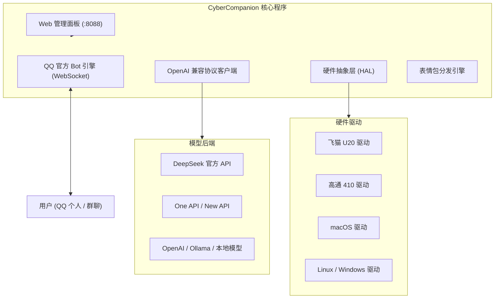

# CyberCompanion

将随身 WiFi、开发板、软路由或个人电脑改造成 24 小时在线的 QQ 机器人助手。单二进制文件部署，内置 Web 管理面板，常驻内存约 20MB。

[](https://github.com/Elysia-SHY/CyberCompanion/actions/workflows/ci.yml)
[](https://github.com/Elysia-SHY/CyberCompanion/actions/workflows/release.yml)
[](https://golang.org)
[](LICENSE)
[]()
[](https://q.qq.com)

---

## ⚠️ 安全须知（请先读这一节）

本程序具备**在宿主设备上执行系统命令**与**读取硬件状态**的能力，一旦口令泄露，等同于把设备交给对方。请务必遵守以下四条：

1. **主人认证口令必须由你自己设置**。程序不提供任何内置默认口令，`passcode` 为空时认证功能处于关闭状态，不会有「弱口令被猜中」的风险。
2. **不要暴露 Web 面板到公网**。面板设计为局域网/本机使用，如需外网访问请自行加反向代理并启用 HTTPS。
3. **`enable_exec` 默认关闭**。只有在确实需要远程执行命令时才打开，并配合 `exec_whitelist` 限定允许的命令前缀。
4. **所有账号密码、密钥请放在 `config.json`**，权限设为 `600`，且**不要提交到 Git**（`.gitignore` 已包含）。

---

## 特性

- **轻量单二进制**：Go 语言编写，前端静态文件打包在可执行文件内部，常驻内存约 20MB，无 Python/Node 等运行环境依赖。
- **硬件状态抽象 (HAL)**：
  - **飞猫 U20 (Unisoc T7510)**：读取 5G NR 信号、RSRP、基站信息、当日出入流量与核心温度。
  - **高通 410 / 210 (MSM8916/8909)**：适配 OpenStick 与各分支随身 WiFi，读取基带状态与负载。
  - **macOS / Windows / Linux**：读取 CPU 架构、系统负载、内存用量与网络连接。
- **内置 Web 管理面板**：默认监听 `8088` 端口，提供状态监控、人设切换、API 密钥修改、实时日志流与内置「更新日志」入口；首次打开引导创建面板密码。
- **多模态图片识别**：支持在 QQ 对话中直接发送图片，调用大模型视觉接口返回内容分析。
- **情境表情包发送**：根据用户输入意图（打招呼、表白、调侃、询问饮食等）自动发送对应的 Base64 本地表情，规避图床防盗链与图裂问题。
- **人设与提示词切换**：预设大肥鱼、爱莉希雅、猫娘与极客助手 4 种性格，支持在聊天或 Web 面板中自定义 System Prompt。
- **权限与访客隔离**：普通用户仅能闲聊与识图，无法触发设备重启或执行命令；发送自定义口令可认证为管理员并持久化保存。
- **流式回复（私聊）**：大模型边生成边发送，长回复不再"发完消息石沉大海"，等待期间还有"💭"即时反馈。群聊仍为一次性发送，避免分段刷屏。
- **上下文按 Token 预算裁剪**：不再按"条数"截断历史，短消息不会被误裁、长消息也不会撑爆上下文窗口。
- **会话记忆持久化**：对话上下文每 60 秒增量落盘（`sessions.json`，0600 权限），进程重启后仍然记得之前聊过什么。
- **不丢消息的发送队列**：出站消息走单 worker 串行队列，失败按指数退避重试 3 次；超长回复自动按语义边界分段。
- **大模型调用容错**：网络/5xx/限流自动重试，连续失败触发熔断；面向用户的提示是"人话"，技术细节只进日志。
- **可观测性**：`/healthz` 健康检查（网关断线或熔断时返回 503）、`/debug/vars` 指标、`CC_DEBUG=1` 时挂载 pprof。
- **优雅关闭**：收到 SIGINT/SIGTERM 后按序停止面板、发送 WebSocket Close 帧、排空发送队列、落盘会话。

---

## 架构



---

## 硬件支持

> **所有平台都提供同一套详细硬件信息。** 运行 `cybercompanion -hardware` 可在任何设备上直接查看本机采集结果，
> 无需启动机器人或 Web 面板。拿不到的项会明确标注「未提供」——**不会返回编造的占位数值**。

| 设备分类 | 代表硬件 / 芯片 | 对应架构 | 运行方式 |
| :--- | :--- | :--- | :--- |
| **5G 随身 WiFi** | 飞猫 U20 (Unisoc T7510 / SP9863A) | `linux-arm64` | 后台进程 / 开机脚本 |
| **4G 随身 WiFi** | 高通 410 (MSM8916 / 8909) | `linux-armv7` | OpenStick / Debian 棒 |
| **Mac (Apple Silicon)** | M1 / M2 / M3 / M4 | `darwin-arm64` | 直接运行 |
| **Mac (Intel)** | 2020 之前 Intel Mac | `darwin-amd64` | 直接运行 |
| **开发板 / 软路由** | 树莓派 4/5, x86 软路由 | `linux-arm64` / `linux-amd64` | Systemd / Docker |
| **Android 手机 / 平板** | Android 7.0+ (ARM64 / ARMv7) | `.apk` 安装包 | APK 直接安装运行 (免 Root) |
| **Windows PC** | Windows 10 / 11 (x64) | `windows-amd64` | `cybercompanion.exe` |

### 各平台采集项一览

`✅` 实际采集 ｜ `—` 该平台不提供（界面与 QQ 消息中会跳过，不显示假数据）

| 采集项 | Linux / 随身 WiFi | Android | Windows | macOS |
| :--- | :---: | :---: | :---: | :---: |
| CPU 型号 | ✅ `/proc/cpuinfo` | ✅ `/proc/cpuinfo` | ✅ 注册表 | ✅ `sysctl` |
| 逻辑核心数 | ✅ | ✅ | ✅ | ✅ |
| CPU 占用率 | ✅ `/proc/stat` 差值 | ✅ 同左 | ✅ `GetSystemTimes` 差值 | ✅ 负载估算 |
| 当前主频 | ✅ `cpufreq` | ✅ `cpufreq` | — | — |
| 平均负载 | ✅ `/proc/loadavg` | ✅ 同左 | — | ✅ `vm.loadavg` |
| 物理内存 | ✅ `/proc/meminfo` | ✅ 同左 | ✅ `GlobalMemoryStatusEx` | ✅ `sysctl` + `vm_stat` |
| 交换分区 | ✅ | ✅ | ✅ 页面文件 | ✅ `vm.swapusage` |
| 磁盘容量 | ✅ `statfs` | ✅ 同左 | ✅ `GetDiskFreeSpaceEx` | ✅ `statfs` |
| 系统运行时长 | ✅ `/proc/uptime` | ✅ 同左 | ✅ `GetTickCount64` | ✅ `kern.boottime` |
| 内核版本 | ✅ `/proc/version` | ✅ 同左 | — | — |
| 系统进程数 | ✅ | ✅ | — | — |
| 温度 | ✅ 热区 / `hwmon` | ✅ 同左 | — | — |
| 电池 | ✅ 若有 | ✅ 容量 + 温度 | ✅ 若有 | ✅ 若有 |
| 网络地址 | ✅ | ✅ | ✅ | ✅ |
| 累计流量 | ✅ `/proc/net/dev` | ✅ 同左 | — | — |
| 调频策略 | ✅ | ✅ | — | — |

一键自检（所有平台通用）：

```bash
./cybercompanion -hardware          # 人类可读报告
./cybercompanion -hardware-json     # JSON 输出，便于脚本采集与工单排查
```

机器人对话中发送 `状态` / `/status`，或在 Web 面板首页查看「详细硬件规格」卡片，均可获得同样的完整信息。

---

## 快速开始

### 步骤 0：首次启动会拿到什么

程序首次启动时会自动创建 `config.json`（权限 `600`），**但不会替你生成面板密码**。第一次打开面板时会先让你创建一个：

```
[WebUI] 管理面板已启动: http://127.0.0.1:8088
```

之所以不自动生成：早期版本会在启动时随机生成一串密码写进 `config.json`，在有终端的机器上只是麻烦，而在 Android / 随身 WiFi 这类看不到配置文件的设备上，用户只能面对一个永远答不对的登录框。现在密码由你自己创建，也就只有你自己知道。

> 忘记密码时，删掉 `config.json` 里的 `web_password` 字段（或整个字段留空）后重启，面板会重新进入创建流程。

> **主人认证口令（`passcode`）同样需要你自己填写** —— 它相当于把设备的控制权交出去，随机值没有意义，只有你自己记得住的口令才有用。

### 方式一：Android 手机 / 平板直接安装 (推荐手机用户)

前往 [Releases 页面](https://github.com/Elysia-SHY/CyberCompanion/releases) 下载 `CyberCompanion-Android-*.apk`。

- 安装后直接启动，应用通过前台常驻服务维持后台 24 小时运行。
- 打开应用即可在手机屏幕上直接操作 Web 控制台，无需 Root 权限。
- 首次打开会引导创建面板密码；之后应用会读取本机配置自动登录，不再重复输入。
- 已在系统层面申请忽略电池优化白名单，并以 `JobScheduler` 作为进程被系统回收后的兜底拉活手段。

### 方式二：随身 WiFi 与 Linux 一键安装

```bash
curl -sSL https://raw.githubusercontent.com/Elysia-SHY/CyberCompanion/main/scripts/install.sh | bash
```

脚本会：

1. 自动检测 CPU 架构并下载对应二进制；
2. **下载 `SHA256SUMS.txt` 并校验文件完整性**，校验不通过立即中止（防止下载被劫持）；
3. 生成权限为 `600` 的默认配置；
4. 在系统上配置 systemd（Linux）或开机脚本（随身 WiFi）实现自启。

可用环境变量：

| 变量 | 说明 | 默认 |
| :--- | :--- | :--- |
| `CC_REPO` | 覆盖仓库地址 `owner/repo` | `Elysia-SHY/CyberCompanion` |
| `CC_VERSION` | 安装指定版本号 | `latest` |
| `CC_SKIP_VERIFY` | 设为 `1` 跳过 SHA256 校验（**不推荐**） | 未设置 |

```bash
# 安装指定版本
CC_VERSION=v1.2.1 bash install.sh

# 内网镜像部署
CC_REPO=your-mirror/CyberCompanion bash install.sh
```

### 方式三：Docker 部署

```bash
git clone https://github.com/Elysia-SHY/CyberCompanion.git
cd CyberCompanion

# 推荐：使用 compose 模板（只绑本机回环、丢弃全部 capabilities、只读根文件系统）
mkdir -p data && cp config.example.json data/config.json
docker compose -f scripts/docker-compose.yml up -d

# 或者手动构建运行
docker build -t cybercompanion:latest -f scripts/Dockerfile .
docker run -d --name cybercompanion \
  -p 127.0.0.1:8088:8088 \
  -v cybercompanion-data:/data \
  --cap-drop ALL --security-opt no-new-privileges:true \
  --restart unless-stopped \
  cybercompanion:latest
```

运行镜像基于 distroless（无 shell、无包管理器），以非 root 用户（uid 65532）运行，配置与会话持久化在 `/data` 卷。

注意端口写法：`127.0.0.1:8088:8088` 只对本机开放，直接写 `8088:8088` 等于把管理面板暴露到公网。

健康检查用程序自带探针（distroless 里没有 curl/wget）：

```bash
docker inspect --format '{{.State.Health.Status}}' cybercompanion
# 也可手动执行：docker exec cybercompanion /cybercompanion -health -config /data/config.json
```

### 方式四：手动下载运行 (Mac / PC / 服务器)

前往 [Releases 页面](https://github.com/Elysia-SHY/CyberCompanion/releases) 下载对应架构的可执行文件与 `SHA256SUMS.txt`，先校验再运行：

```bash
# 校验完整性（Linux）
sha256sum -c SHA256SUMS.txt --ignore-missing

# 校验完整性（macOS）
shasum -a 256 -c SHA256SUMS.txt --ignore-missing

# macOS Apple Silicon
chmod +x cybercompanion-darwin-arm64
./cybercompanion-darwin-arm64

# Linux / 飞猫 U20
chmod +x cybercompanion-linux-arm64
./cybercompanion-linux-arm64

# Windows
cybercompanion.exe
```

启动后访问 `http://localhost:8088`（随身 WiFi 连接热点后访问 `http://192.168.88.1:8088`）进入管理面板。

---

## 首次配置流程

1. 打开 Web 面板 `http://<设备IP>:8088`。首次使用会先引导创建面板密码，创建后直接进入面板；之后每次打开输入该密码即可（Android App 会自动登录，无需输入）。
2. 在「参数设置」页填入 QQ 机器人 `AppID`、`AppSecret` 与大模型 API Key。
3. **在「参数设置」页设置主人认证口令**（`passcode`），保存后即刻生效。
4. 在 QQ 中私聊机器人，发送你刚设置的口令，即可完成主人认证，当前账号会被写入 `owners.json`。
5. 面板与 QQ 均可在后续随时修改人设、模型与口令。

> 口令认证带有限流保护：连续输错 5 次会在 10 分钟窗口后锁定该用户 30 分钟。若忘记口令，可直接编辑 `config.json` 的 `passcode` 字段后重启程序。

---

## Web 管理面板

- **状态概览**：查看设备当前网络信号、流量消耗、内存利用率与 QQ 网关连接状态。
- **人设配置**：点击预设卡片切换角色，或在输入框中直接修改 System Prompt。
- **参数设置**：修改 QQ 机器人的 AppID、Secret、模型接口地址与认证口令，保存后即时生效。密钥在界面上以 `Supe••••••••3456` 形式掩码显示。
- **运行日志**：查看 WebSocket 消息收发与大模型调用详情，日志按增量追加刷新。

### 常用配置字段

| 字段 | 默认值 | 说明 |
| :--- | :--- | :--- |
| `stream_reply` | `true` | 私聊流式输出开关。群聊恒为非流式；若网关不支持 SSE 会自动回退 |
| `token_budget` | `6000` | 上下文 token 预算，超预算从最早的历史开始丢弃 |
| `max_history_msgs` | `40` | 普通会话的消息条数上限（主人为其 5 倍，下限 200 条） |
| `web_port` | `8088` | 面板监听端口 |
| `enable_exec` | `false` | 远程命令总开关；开启时建议同时配置 `exec_whitelist` |
| `passcode` | 空 | 主人认证口令。留空则主人模式关闭 |

运行期还会生成两个文件：`sessions.json`（会话记忆，0600）与 `exec_audit.log`（命令审计）。

---

## 交互指令

### 管理员指令

| 指令 | 说明 |
| :--- | :--- |
| `状态` / `/status` | 输出当前硬件信号、流量、温度与内存信息 |
| `人设` | 查看当前人设与可选预设 |
| `人设 陪伴` / `人设 大肥鱼` / `人设 猫娘` / `人设 助手` | 切换指定性格 |
| `设定人设 <文本>` | 自定义人设并重置上下文 |
| `清除记忆` / `/clear` | 清空双方的多轮上下文记录 |
| `重启` / `/reboot` | 在支持的设备上执行系统软重启 |
| `/exec <命令>` | 在设备终端执行命令并返回输出（需 `enable_exec` 打开） |

### 认证方式

初次使用时向机器人私聊发送**你在面板中设置的 `passcode`**，程序会将当前用户的 OpenID 写入 `owners.json`，完成管理员认证。

> 本项目**不提供内置默认口令**。早期版本的 `复活吧我的爱人！！！elyisa` 已被移除，因为源码公开意味着该口令等同于「任何人都是主人」。如果你是从旧版本升级，程序会在加载配置时自动清空这个已知的公开口令，并要求你重新设置。

---

## 源码编译

编译需要 Go 1.21 或更高版本：

```bash
git clone https://github.com/Elysia-SHY/CyberCompanion.git
cd CyberCompanion

# 编译当前平台（带版本号注入）
go build -ldflags "-X main.version=v1.1.0 -X main.commit=$(git rev-parse --short HEAD)" \
  -o cybercompanion ./cmd/cybercompanion

# 交叉编译 macOS Apple Silicon
GOOS=darwin GOARCH=arm64 go build -o cybercompanion-darwin-arm64 ./cmd/cybercompanion

# 交叉编译 飞猫 U20
GOOS=linux GOARCH=arm64 go build -o cybercompanion-linux-arm64 ./cmd/cybercompanion

# 交叉编译 高通 410
GOOS=linux GOARCH=arm GOARM=7 go build -o cybercompanion-linux-armv7 ./cmd/cybercompanion

# 交叉编译 Windows
GOOS=windows GOARCH=amd64 go build -o cybercompanion-windows-amd64.exe ./cmd/cybercompanion
```

查看版本：

```bash
./cybercompanion -version    # 多行详情：版本、提交、构建时间、平台、Go 版本
./cybercompanion -V          # 单行摘要，便于脚本 grep

# 示例输出
# cybercompanion v1.2.1 (12d44c08) linux/amd64 built 2026-09-20T01:40:00Z
```

### 硬件信息自检

在新设备上部署前，建议先跑一遍硬件自检，确认平台识别与采集是否正常：

```bash
./cybercompanion -hardware
```

输出示例（x86 Linux 容器）：

```
========== 硬件信息 ==========
平台驱动   : Linux Standard / Raspberry Pi (amd64)
主机名     : edge-node-01
系统 / 架构: linux / amd64
---------- CPU ----------
型号       : AMD EPYC 9K65 192-Core Processor
逻辑核心   : 32
当前主频   : 2800 MHz
占用率     : 3.2%
平均负载   : 2.43 / 2.45 / 2.37
---------- 内存 ----------
物理内存   : 18004 MB / 126277 MB (14%)
---------- 存储 ----------
根分区     : 3.0 GB / 256.0 GB  (/)
---------- 系统 ----------
运行时长   : 2h 29m
内核版本   : 6.6.117-45.11.6.tl4.x86_64
---------- 温度 ----------
温度       : 本平台未提供（不再返回估算值）
---------- 网络 ----------
网络类型   : 有线以太网
本机地址   : eth0 172.24.0.5, docker0 172.17.0.1

注：以下项当前平台未提供 → temperatures
==============================
```

需要在脚本里消费这些数据时，用 JSON 模式：

```bash
./cybercompanion -hardware-json | jq '.device.details.cpu_usage'
```

---

## 持续集成与发布

本项目完全由 GitHub Actions 驱动，本地无需任何构建环境。

### `ci.yml` — 每次推送/PR 自动执行

| Job | 内容 |
| :--- | :--- |
| `lint` | `gofmt` 格式检查、`go mod tidy` 一致性、`go vet`、`govulncheck` 漏洞扫描 |
| `test` | `go test -race -covermode=atomic` 竞态检测 + 覆盖率统计，并上传覆盖率报告 |
| `build` | 6 平台交叉编译矩阵 + 二进制冒烟测试（`-version` 输出校验） |
| `android` | Gradle `assembleDebug` 编译 APK 验证 Android 工程可构建 |

### `release.yml` — 打 tag 自动发版

推送形如 `v1.1.0` 的 tag 即触发：

1. 6 平台并行编译，逐产物输出 SHA256；
2. 构建 APK（若配置了 `ANDROID_KEYSTORE_BASE64` 等 Secrets 则签名 release 包，否则回退 debug 并告警）；
3. 汇总所有产物，生成 `SHA256SUMS.txt` 与一键校验脚本 `verify.sh`；
4. 创建 GitHub Release 并附带完整下载说明。

```bash
git tag v1.1.0
git push origin v1.1.0
```

---

## 许可证

本项目采用 [GPL-3.0](LICENSE) 许可证分发。
