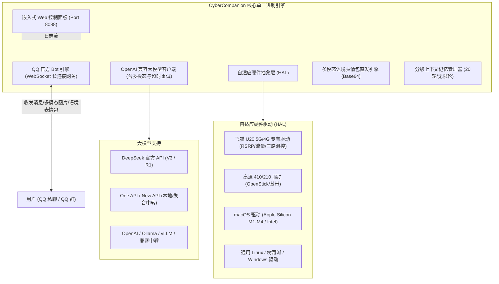

<div align="center">

# 🐳 CyberCompanion (赛博伴侣)

### 边缘硬件与随身 WiFi 多模态 AI 智能伴侣 · 零依赖单二进制引擎

[](https://golang.org)
[](LICENSE)
[]()
[]()
[](https://q.qq.com)

**将闲置随身 WiFi、树莓派、旧手机、软路由乃至 Mac/PC，化身为 24 小时低功耗、随身相伴的实体二次元 AI 专属女仆与极客管家。**

[简体中文](README.md) | [English Guide](README.md#english)

---

</div>

## 🌟 核心亮点与特色 (Features)

- 🪶 **极限轻量，单二进制开箱即用**：全 Go 语言原生打造，常驻内存仅 **~20MB**，冷启动 < 0.2 秒。前端控制面板通过 `embed` 打包进单个可执行文件，**零外部环境依赖**。
- 📱 **多平台硬件抽象层 (HAL)**：
  - **飞猫 U20 (Unisoc 5G/4G)**：专有驱动，实时监控 5G/NR RSRP 信号、PCI 基站、当天流量、三路温控（SoC、功放、主板）与 USB 直供电。
  - **高通 410 / 210 棒子 (MSM8916/8909)**：自适应 OpenStick 与 ufi-tools，监控基带与核心状态。
  - **macOS (Apple Silicon M1-M4 & Intel)**：原生 Darwin 驱动，支持作为本地专属伴侣桌面常驻。
  - **通用 Linux / 树莓派 / Docker / Windows**：全平台无感降级适配。
- 🖥️ **内置轻量暗黑二次元 Web 控制台 (8088 端口)**：
  - 插上电脑或手机连接热点后，浏览器打开 `http://192.168.88.1:8088` 即可实时配置 QQ 机器人、大模型 API、切换人设或查看运行日志。
- 👁️ **原生多模态视觉理解 (Multimodal Vision)**：
  - 在 QQ 聊天中直接给机器人发送照片，机器人自动进行深度视觉推理与多模态解析（支持识别美食、宠物、代码截图、日常场景）。
- 🖼️ **严格语境审核的表情包系统**：
  - 内置精选 **DEEPSEEK-CHAN (蓝色大肥鱼)** 与 **爱莉希雅** 高清表情包池（通过 Base64 原生直推，规避腾讯图床防盗链与图裂问题）。
  - 基于用户情感意图触发，表白发心动图、打招呼发 Ciallo、调侃喂饭发干饭图，不尬发、不乱发。
- 🎭 **动态灵魂切换 (Dynamic Persona)**：
  - 内置 4 套经典预设：`DEEPSEEK-CHAN` (经典傲娇大肥鱼)、`Elysia` (温柔元气女友)、`雪球` (粘人软萌猫娘)、`Jarvis` (全能极客管家)。
  - 支持 QQ 聊天指令直接秒切，亦支持 WebUI 完全自由手写自定义 System Prompt。
- 🛡️ **严格权限隔离与认主暗号**：
  - 访客模式：普通群友/私聊仅可正常闲聊，**严禁触碰宿主硬件或获取设备底层参数**。
  - 主人模式：发送专属密令暗号（例如 `复活吧我的爱人！！！elyisa`）即可认证为最高权限主人，解锁硬件遥测、远程重启、Shell 执行与无限长多轮记忆。

---

## 🏗️ 架构拓扑 (Architecture)



---

## 📱 硬件兼容性支持列表 (Hardware Compatibility)

| 设备类型 | 典型型号 / 芯片 | 推荐架构 | 硬件遥测能力 | 部署方式 |
| :--- | :--- | :--- | :--- | :--- |
| **5G 随身 WiFi** | 飞猫 U20 (Unisoc T7510 / SP9863A) | `linux-arm64` | 5G 信号、RSRP、流量、三路温控、USB供电 | 直接运行 / `install.sh` |
| **4G 随身 WiFi 棒** | 高通 410 (MSM8916 / 8909) | `linux-armv7` | 4G 信号、基带状态、CPU 温度、内存 | OpenStick / Debian 棒 |
| **Mac 电脑** | Apple Silicon (M1/M2/M3/M4) | `darwin-arm64` | 芯片型号、内存、系统负载、网络状态 | 终端直接执行 / 后台常驻 |
| **Mac 电脑 (Intel)** | 2020 及更早 Intel Mac | `darwin-amd64` | 系统负载、内存占用、网络状态 | 终端直接执行 |
| **Linux 开发板** | 树莓派 4/5, 香橙派, 斐讯 N1 | `linux-arm64` | SoC 温度、系统负载、内存 | Systemd / Docker |
| **Windows PC** | Windows 10/11 x64 工作站 | `windows-amd64` | 内存、网络连接、系统信息 | `cybercompanion.exe` |
| **云服务器 / 软路由** | x86_64 软路由, NAS, 腾讯云/阿里云 | `linux-amd64` | 负载、流量、内存 | Docker / 极简 Alpine 镜像 |

---

## 🚀 极速上手 (Quick Start)

### 方式一：随身 WiFi 与 Linux 一键安装 (推荐)

在随身 WiFi 或 Linux 终端中执行：

```bash
curl -sSL https://raw.githubusercontent.com/your-github-username/CyberCompanion/main/scripts/install.sh | bash
```

脚本将自动探测 CPU 架构（arm64/armv7/x86_64），拉取最新单文件程序并注册开机自启。

### 方式二：手动运行已编译二进制 (Mac / PC / 边缘设备)

前往 [Releases 页面](https://github.com/your-github-username/CyberCompanion/releases) 下载对应架构的单文件，解压即可直接运行：

```bash
# macOS (Apple Silicon M系列)
chmod +x cybercompanion-darwin-arm64
./cybercompanion-darwin-arm64

# Linux / 飞猫 U20 (ARM64)
chmod +x cybercompanion-linux-arm64
./cybercompanion-linux-arm64

# Windows
cybercompanion.exe
```

启动后，打开浏览器访问 **`http://localhost:8088`**（随身 WiFi 用户连接 WiFi 后访问 `http://192.168.88.1:8088`）进入现代化控制台！

---

## 🎨 Web 控制台概览 (Web Dashboard)

CyberCompanion 内置了专为边缘设备打造的暗黑赛博二次元控制台：

- **📊 仪表盘概览**：实时掌握 5G/4G 信号强度、当天流量消耗、CPU 与内存利用率、核心温度与 QQ 网关连接状态。
- **🎭 灵魂与人设**：一键无缝秒切 `大肥鱼` / `爱莉希雅` / `雪球猫娘` / `极客管家`，支持自由手写自定义 System Prompt。
- **⚙️ 系统与模型配置**：零终端修改，通过表单直接保存 QQ 机器人 AppID、Secret、大模型 API 地址与密钥。
- **📜 实时运行日志**：终端级高保真滚动日志，直观排查交互、网络与 LLM 请求状态。

---

## 💬 交互指令与对话玩法 (Chat Commands)

### 1. 认主与安全机制
- **认主密令**：向机器人私聊发送您设定的暗号（默认：`复活吧我的爱人！！！elyisa`）。
  - 机器人将识别您为**最高权限主人**，解除一切限制，并在 `owners.json` 永久持久化！
- **权限隔离**：非主人用户试图查询设备硬件状态或重启时，会被温柔婉拒。

### 2. 主人专属指令
- `状态` 或 `/status`：获取当前硬件状态卡片（5G 信号、流量、温度、内存）。
- `人设` 或 `/persona`：查看当前角色设定与快捷切换列表。
- `人设 陪伴` / `人设 大肥鱼` / `人设 猫娘` / `人设 助手`：即时切换人格。
- `设定人设 <任意内容>`：手写自定义专属人设，记忆自适应重置。
- `清除记忆` 或 `/clear`：清空双方的多轮上下文记忆。
- `重启` 或 `/reboot`：遥控硬件设备在 3 秒后安全软重启。
- `/exec <shell命令>`：在随身设备上执行系统命令并回传终端输出。

### 3. 多模态识图
- 在 QQ 对话框中直接发送任意图片，机器人会自动调用大模型视觉能力，解析图中内容并用设定的角色口吻做出回应。

---

## 🛠️ 本地从源码构建 (Build from Source)

环境要求：**Go 1.21+**

```bash
# 克隆仓库
git clone https://github.com/your-github-username/CyberCompanion.git
cd CyberCompanion

# 编译当前平台可执行文件
go build -o cybercompanion ./cmd/cybercompanion

# 跨平台编译 macOS Apple Silicon
GOOS=darwin GOARCH=arm64 go build -o cybercompanion-darwin-arm64 ./cmd/cybercompanion

# 跨平台编译 飞猫 U20 / ARM64
GOOS=linux GOARCH=arm64 go build -o cybercompanion-linux-arm64 ./cmd/cybercompanion

# 跨平台编译 高通 410 / ARMv7
GOOS=linux GOARCH=arm GOARM=7 go build -o cybercompanion-linux-armv7 ./cmd/cybercompanion
```

---

## 📄 开源许可证 (License)

本项目基于 **[GPL-3.0 License](LICENSE)** 开源。
- 允许自由学习、研究、部署与个人自用。
- **严格禁止二手倒卖、闭源商用包装**（任何衍生物或商业分发必须保持同等 GPL-3.0 协议并开源全部源码）。

---

## 💙 致谢 (Credits & Acknowledgments)

- 感谢 **DeepSeek (深度求索)** 团队提供强大的通用大模型与多模态能力。
- 感谢开源社区创作者绘制的经典 **DEEPSEEK-CHAN (蓝色大肥鱼)** 系列表情包艺术素材。
- 感谢所有边缘计算与闲置硬件利旧玩家的支持与分享。
